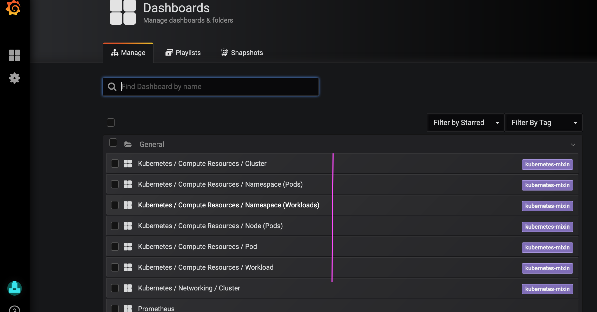
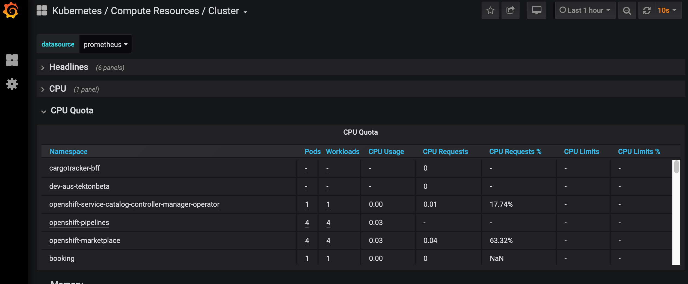
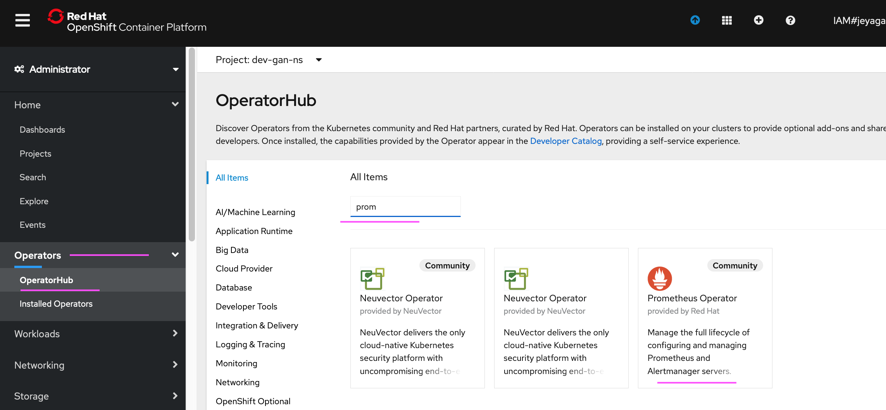
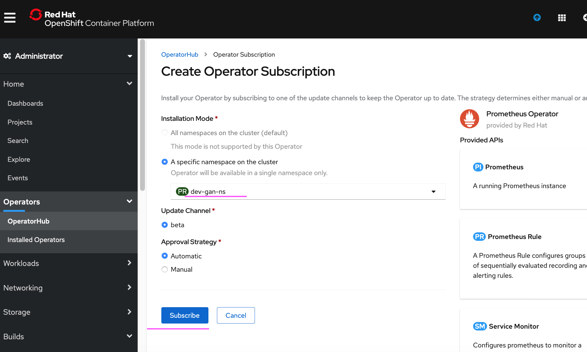
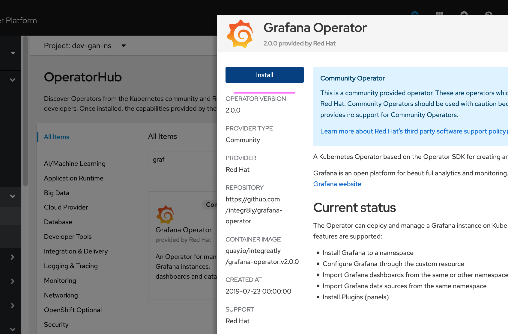
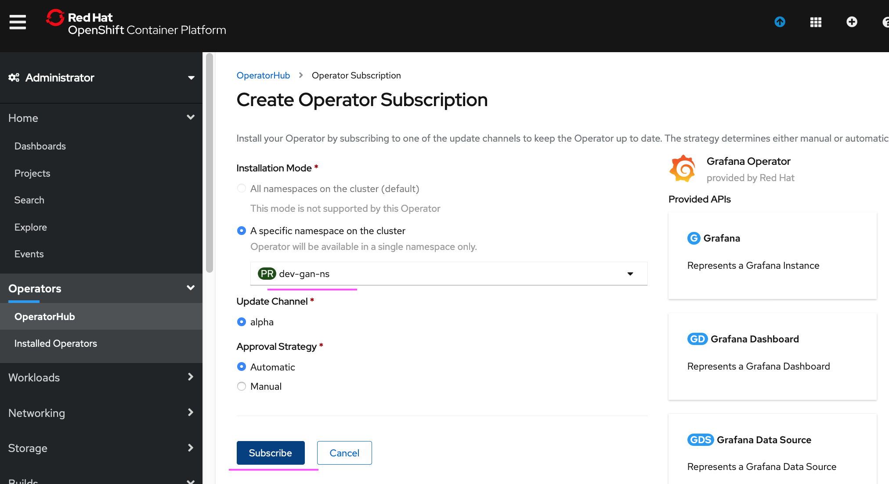
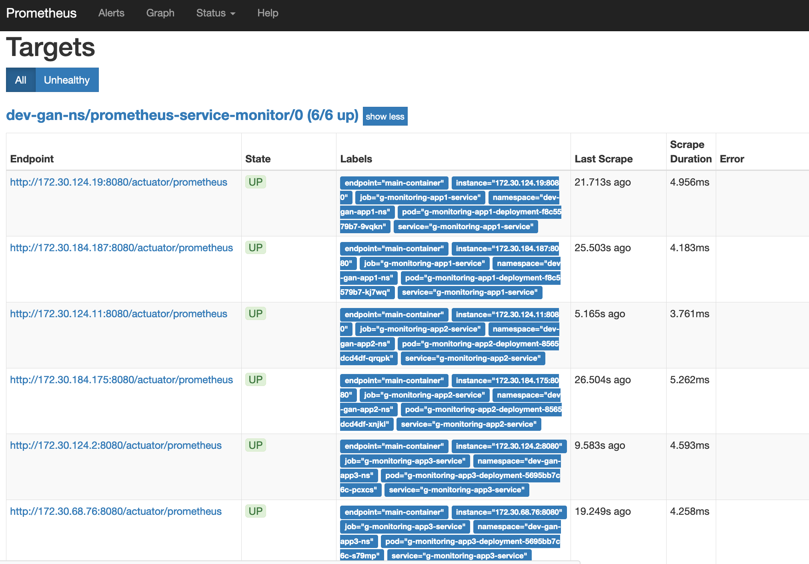
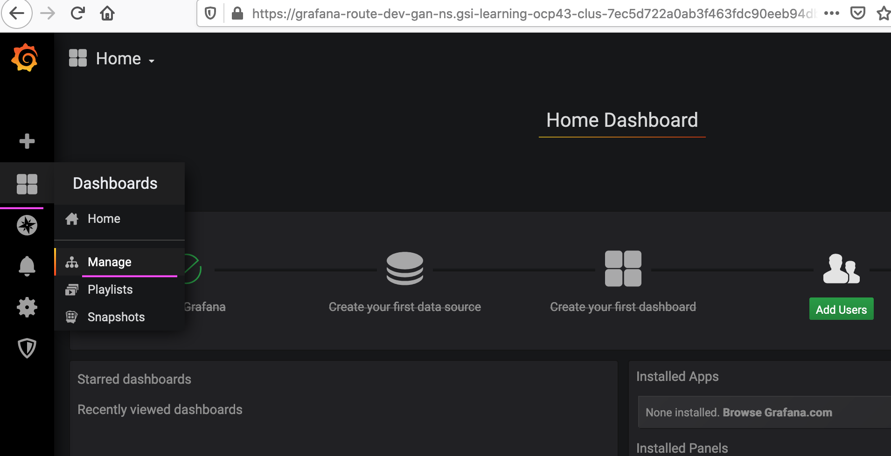
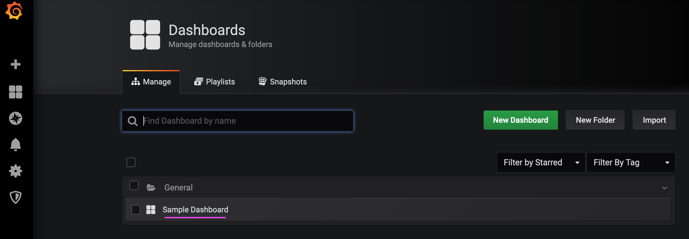
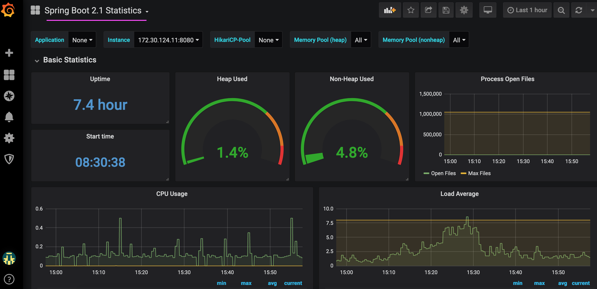

# Monitoring with Prometheus and Grafana in RedHat Openshift 4.3

Redhat Openshift 4.3 cluster monitoring can be done using Prometheus and Grafana.

This document explains about the following.

```
1. How to use the default Grafana dashboard available in Openshift.
2. How to install Prometheus and Grafana Operators
3. How to install Prometheus and Grafana Operators instances, service monitors and sample dashboards.
4. How to import and view Custom dashboards. 
```


# 1. Accessing Default Grafana Dashboard

By default Prometheus and Grafana operators are pre-installed in Openshift and populated with default dashboards. They are installed in openshift-monitoring namespace.

They are readonly and can’t be modified.

The  dashboards can be accessed as below.

<details><summary>CLICK ME</summary>

#### 1. Open Grafana Dashboard

Choose the `Monitoring > Dashboards` menu.


#### 2. Open Home Dashboard page

Choose the `Manage` menu.


#### 3. Choose the Dashboard

Choose any one of the available dashboards.



#### 4. Graphs

See the different graphs available.





</details>


# 2. Install Prometheus and Grafana Operators

As the default dashboards can't be modified, to make custom dashboards, it is required to install Prometheus and Grafana Operators in another namespace. 

The steps are as given below

## 2.1 Install Prometheus Operators

<details><summary>CLICK ME</summary>
1. Run the below command to create a namespace

```
oc new-project dev-gan-ns
```

2. Click on the menu `Operators > Operator Hub` menu.

3. Enter `Prom` in the text box.

4. Click on `Prometheus Operator` 



5. Click on `Install` 


6. Make sure that the namespace is correct and click on  `Subscribe` 



7. Operator installed successfully.


</details>

## 2.2 Install Grafana Operators
<details><summary>CLICK ME</summary>
1. Click on the menu `Operators > Operator Hub` menu.

2. Enter `Gra` in the text box.

3. Click on `Grafana Operator` 


4. Click on `Install` 



5. Make sure that the namespace is correct and click on  `Subscribe` 



6. Operator installed successfully.


</details>


# 3. Install the Prometheus and Grafana Operator instances

<details><summary>CLICK ME</summary>

After installing Prometheus and Grafana Operator it is required to install Operator instances as given below.

1. Download this repo from GIT

2. Goto the folder `prometheus-grafana-openshift-430/scripts/install` in command line.

3. Run the below command.

```
sh 01-install.sh
```

The scripts will install and create the below things

```
    1. Sample applications

    2. Prometheus Instance
    3. Prometheus Service Monitor
    4. Prometheus Route

    5. Grafana Operator instances
    6. Grafana Datasource
    7. Grafana Sample Dashboard
    8. Grafana Route
```

4. Verify the routes are created for Prometheus and Grafana dashboards.


</details>


# 4. Creating and Accessing Custom Dashboard

Using the created Prometheus and Grafana operator instances, new dashboards can be created and accessed.

## 4.1. Accessing Prometheus Dashboard
<details><summary>CLICK ME</summary>
Prometheus will comes with a very simple dashboard.

1. Goto the Route screen in the web console .


2. Click on the Prometheus route link. 

It will take you to Prometheus web console.

3. Choose the any of the query param that you are interested and click on `execute`.


4. You can see the output like this.


5. Prometheus Targets.

The targets in which prometheus is scraping the data can be seen here. 




</details>

## 4.2. Accessing Grafana Dashboard

<details><summary>CLICK ME</summary>
1. Goto the `Routes` screen in the web console .


2. Click on the Grafana route link. 

It takes to Grafana web console.

### Sample Dashboard

1. Choose the `manage` menu.



2. It will show the dashboard home page.

The installed `Sample Dashboard` should be displayed there.



3. Click on the `Sample Dashboard` to see the sample dashboard that was created as part of the installation.


### Datasource

1. Choose the `Configuration > Datasource` menu to open the Datasource home page.

It will show the dashboard configuration page.


2. It will show the dashboard configuration page. Click the datasource.


3. It shows the datasurce details page.

You can modify datasource parameters for prometheus.

You can click on `Save & Test`, to check whether this grafana is able to connect to Prometheus (a datasource).


</details>

## 4.3. Importing pre-created Grafana Dashboard

<details><summary>CLICK ME</summary>
The pre-created Grafana dashboard can be imported to the grafana to install ready made dashboard.

Some of the pre-created dashboards are available in the below links.

```
Spring Boot 2.1 Statistics
https://grafana.com/grafana/dashboards/10280

K8s Cluster Summary
https://grafana.com/grafana/dashboards/8685

Openshift/K8 Cluster Overview
https://grafana.com/grafana/dashboards/3870

K8 Cluster Detail Dashboard
https://grafana.com/grafana/dashboards/10856
```

1. Click on `Create > Import` menu


2. Enter the pre-created dashboard id `10280` in the text box.

```
Spring Boot 2.1 Statistics
https://grafana.com/grafana/dashboards/10280
```


3. Choose the datasource of the dashboard as Prometheus in the list box. Then click on the import.


4. The imported dashboard would be like this.




</details>

