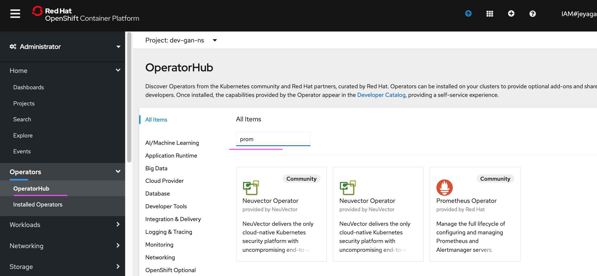
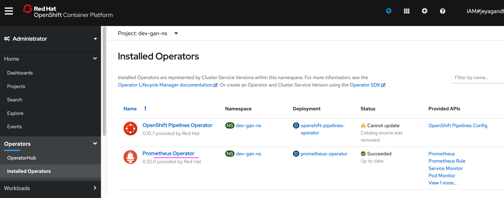
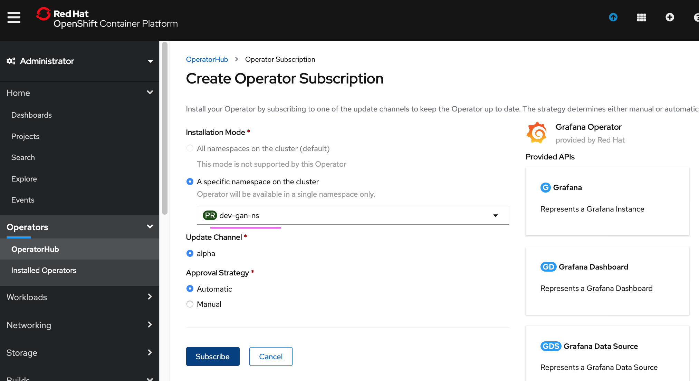
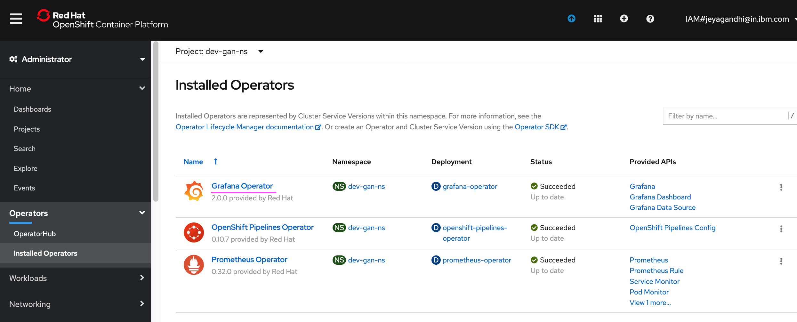

# Install Prometheus and Grafana Operators

As the default dashboards can't be modified, to make custom dashboards, it is required to install Prometheus and Grafana Operators in another namespace. 

The steps are as given below

## Install Prometheus Operators

1. Run the below command to create a namespance

```
oc new-project dev-gan-ns
```

2. Click on the menu `Operators > Operator Hub` menu.

3. Enter `Prom` in the text box.

4. Click on `Prometheus Operator` 



5. Click on `Install` 


6. Male sure the namespace is correct and click on  `Subscribe` 


7. Operator installed successfully.




## Install Grafana Operators

1. Click on the menu `Operators > Operator Hub` menu.

2. Enter `Gra` in the text box.

3. Click on `Grafana Operator` 


4. Click on `Install` 


5. Male sure the namespace is correct and click on  `Subscribe` 



6. Operator installed successfully.




# Back to home page

[Back](../) 
