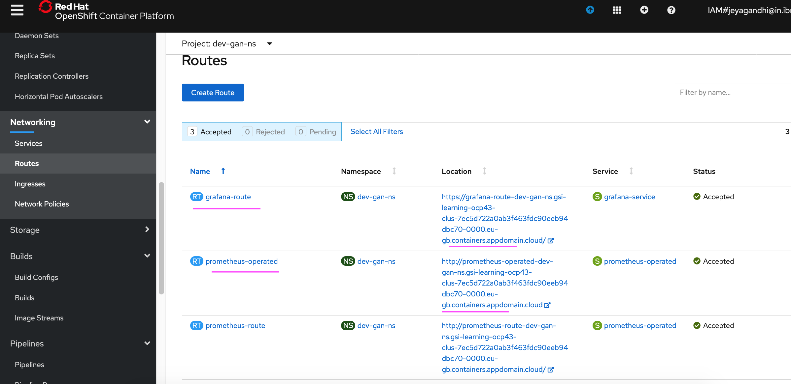

# Install the Prometheus and Grafana Operator instances

After installing Prometheus and Grafana Operator it is required to install Operator instances as given below.

1. Download this repo from GIT

2. Goto the folder `prometheus-grafana-openshift-430/scripts/install` in command line.

3. Run the below command.

```
sh 01-install.sh
```

The scripts will install and create the below things

```
    1. Sample applications

    2. Prometheus Instance
    3. Prometheus Service Monitor
    4. Prometheus Route

    5. Grafana Operator instances
    6. Grafana Datasource
    7. Grafana Sample Dashboard
    8. Grafana Route
```

4. Verify the routes are created for Prometheus and Grafana dashboards.




[Previous](../02-install-operators)  [Next](../04-custom-dashboard) 
