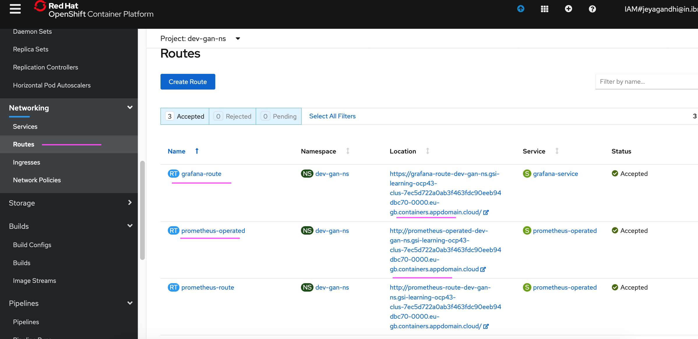
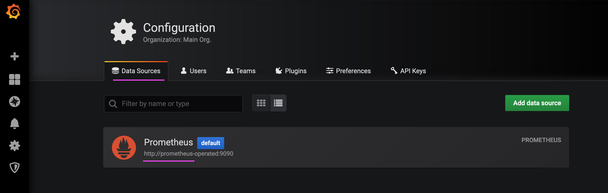
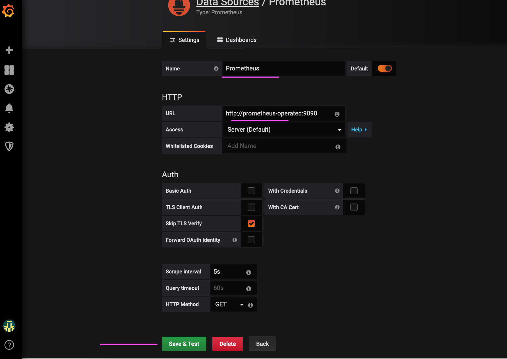
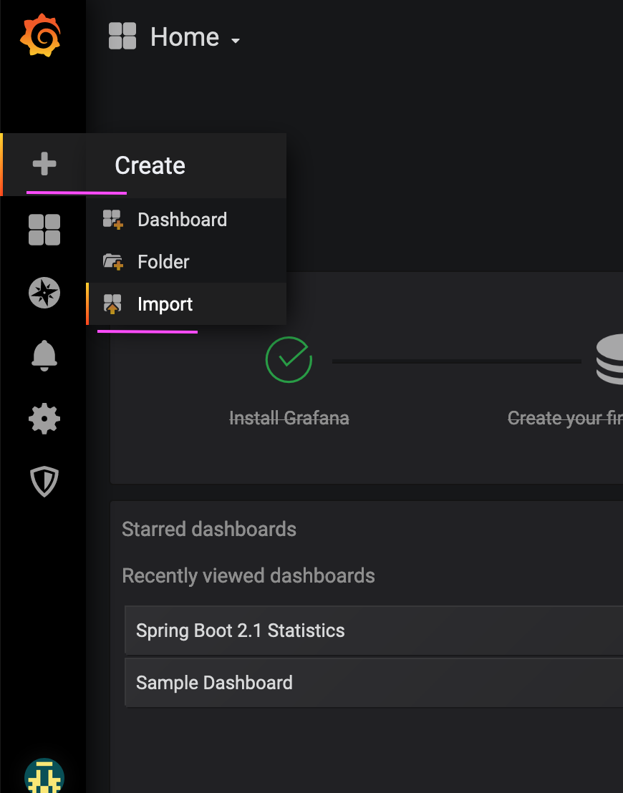
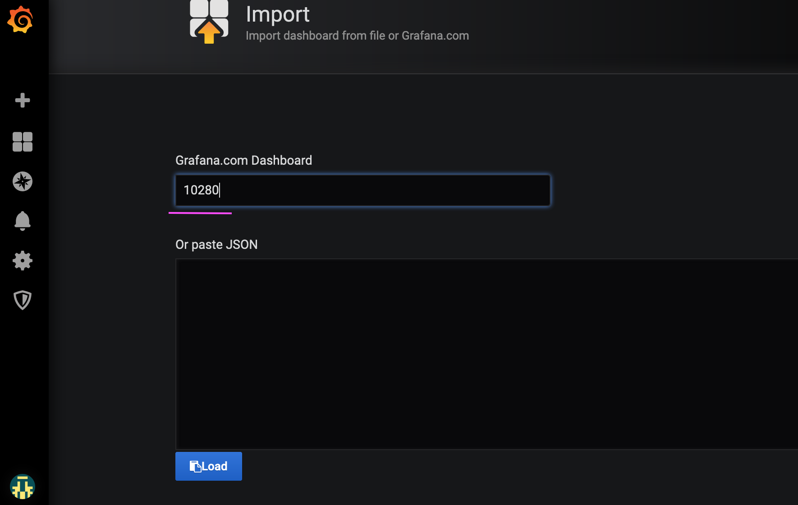
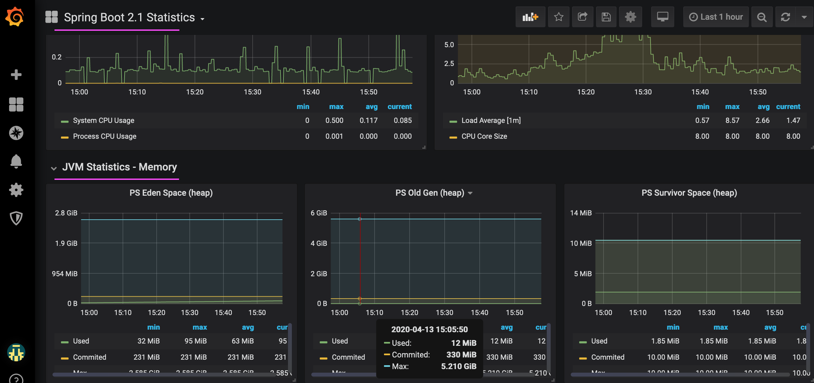

# Accessing Custom Dashboard

We can access the custom dashboard as given below.

## 1. Accessing Prometheus Dashboard

1. Goto the Route screen in the web console .



2. Click on the Prometheus route link. 

It will take you to Prometheus web console.

3. Choose the any of the query param that you are interested and click on `execute`.


4. You can see the output like this.


## 2. Accessing Grafana Dashboard

1. Goto the Route screen in the web console .


2. Click on the Grafana route link. 

It will take you to Grafana web console.

### Sample Dashboard

1. Choose the `manage` menu.


2. It will show you the dashboard home page.

The installed `Sample Dashboard` should be displayed there.


### Datasource

1. Choose the `Configuration > Datasource` menu to open the Datasource home page.

It will show you the dashboard configuration page.


2. It will show you the dashboard configuration page. Click the datasource.



3. It shows the datasurce details page.

You can modify datasource parameters for prometheus.

You can click on "Save & Test", to check whether this grafana is able to connect to Prometheus (a datasource).



## Importing pre-created Grafana Dashboard

The pre-created Grafana dashboard can be imported to the grafana to create ready made dashboard.

Some of the pre-created dashboards are available in the below links.

```
Spring Boot 2.1 Statistics
https://grafana.com/grafana/dashboards/10280

K8s Cluster Summary
https://grafana.com/grafana/dashboards/8685

Openshift/K8 Cluster Overview
https://grafana.com/grafana/dashboards/3870

K8 Cluster Detail Dashboard
https://grafana.com/grafana/dashboards/10856
```

1. Click on `Create > Import` menu



2. Enter the pre-created dashboard id `10280` in the text box.

```
Spring Boot 2.1 Statistics
https://grafana.com/grafana/dashboards/10280
```



3. Choose the datasource of the dashboard as Prometheus in the list box. Then click on the import.


4. The imported dashboard would like this.


